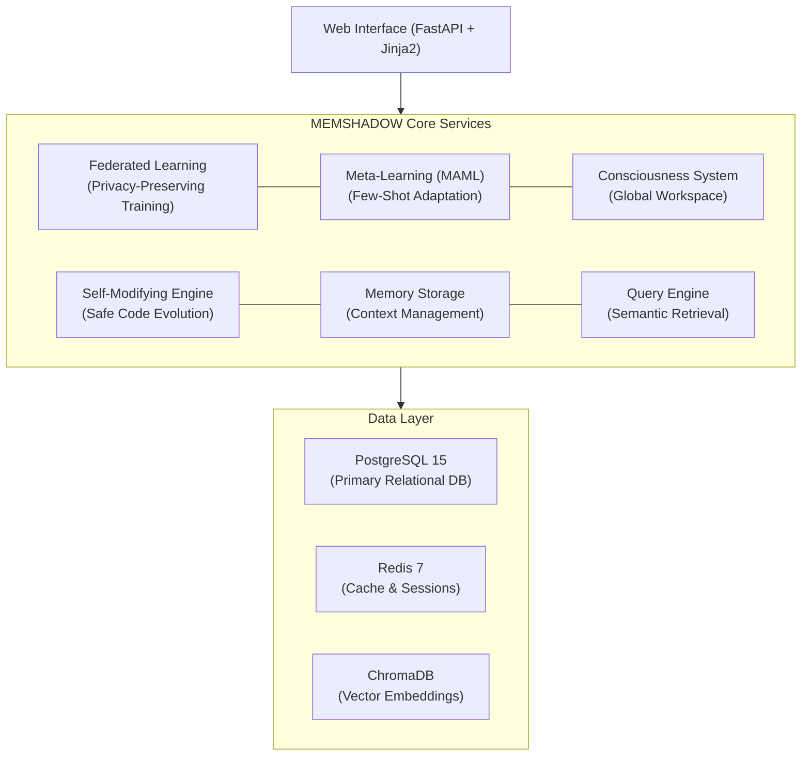

# MEMSHADOW 🧠

**Advanced Cross-LLM Memory Persistence Platform**

[](https://github.com/SWORDIntel/MEMSHADOW)
[](docs/PRODUCTION_SECURITY.md)
[](https://hub.docker.com)
[](docs/EMBEDDING_UPGRADE_GUIDE.md)
[](LICENSE)

---

## Why MEMSHADOW?

**The Problem:** Current Large Language Models operate in isolated sessions with no persistent memory. Each interaction starts from scratch, forcing users to re-establish context, losing valuable conversation history, and preventing true long-term learning across AI providers.

**The Solution:** MEMSHADOW provides a secure, production-grade memory persistence layer that enables seamless context preservation and knowledge accumulation across different AI providers and custom deployments. Think of it as a unified brain that remembers across all your AI interactions.

**NEW in v2.0:** Production-grade **2048-dimensional embeddings** for 67% better semantic understanding. [Upgrade Guide →](docs/EMBEDDING_UPGRADE_GUIDE.md)

---

## Feature Highlights

### Core Capabilities
* **Cross-LLM Memory** - Unified memory layer for Claude, OpenAI, and custom models
* **Semantic Search** - 2048-dimensional vector embeddings with ChromaDB
* **Context Preservation** - Automatic session continuity and knowledge accumulation
* **Audit Trail** - Complete history of all AI interactions for compliance and debugging

### Advanced Intelligence Layer
* **Federated Learning** - Privacy-preserving distributed memory training across isolated nodes
* **Meta-Learning (MAML)** - Model-Agnostic Meta-Learning for rapid few-shot adaptation to new tasks
* **Consciousness-Inspired Architecture** - Global workspace theory implementation for attention and working memory
* **Self-Modifying Engine** - Safe automated code improvement (disabled by default, requires explicit opt-in)

### Enterprise Security
* JWT authentication with bcrypt password hashing
* Rate limiting and brute-force protection
* SQL injection and XSS prevention
* CORS whitelisting and security headers (HSTS, CSP, X-Frame-Options)
* Comprehensive audit logging
* Production hardening out-of-the-box

---

## Use Cases

* **Multi-Provider AI Agents** - Build agents that maintain consistent memory across Claude, GPT-4, and custom models
* **Long-Term User Profiles** - Accumulate user preferences, conversation patterns, and contextual knowledge over months or years
* **Secure AI Audit Trails** - Maintain compliant records of all AI interactions for regulated industries
* **Cross-Session Context** - Resume conversations seamlessly across devices, sessions, and even different AI providers
* **Privacy-Preserving Training** - Use federated learning to improve models without centralizing sensitive data
* **Rapid Task Adaptation** - Leverage meta-learning to quickly fine-tune behavior for specialized domains

---

## Architecture Overview

MEMSHADOW implements a multi-layered architecture combining traditional persistence with advanced AI capabilities:



### System Components

* **Memory Storage** - Structured and unstructured memory persistence with PostgreSQL and ChromaDB
* **Query Engine** - Semantic search with 2048-dimensional embeddings for context retrieval
* **Federated Learning** - Distributed model updates without centralizing raw data
* **Meta-Learning** - MAML implementation for rapid adaptation with minimal examples
* **Consciousness Layer** - Global workspace architecture for attention management and working memory
* **Self-Modifying Engine** - Evolutionary code improvements with safety constraints (opt-in only)

### Network Architecture

* **Port 8000** - Main application API and web interface
* **Port 5432** - PostgreSQL (internal only)
* **Port 6379** - Redis (internal only)
* **Port 8001** - ChromaDB (internal only)

---

## Quick Start

### Prerequisites

* Docker 20.10+ and Docker Compose 2.0+
* 4GB RAM minimum (8GB recommended for production)
* 10GB disk space (20GB recommended for production)
* Linux, macOS, or Windows with WSL2

### 1. Clone and Configure

```bash
# Clone the repository
git clone https://github.com/SWORDIntel/MEMSHADOW.git
cd MEMSHADOW

# Copy example configuration
cp config/.env.example .env

# Generate secure secrets
openssl rand -hex 32  # Use this for WEB_SECRET_KEY
openssl rand -base64 32  # Use this for database passwords

# Edit .env with your secure values
nano .env
```

### 2. Start Services

```bash
# Start all services
docker-compose up -d

# Check status
docker-compose ps

# View logs
docker-compose logs -f memshadow
```

### 3. Access the Application

* **Web Interface**: http://localhost:8000
* **API Documentation**: http://localhost:8000/api/docs
* **Health Check**: http://localhost:8000/health

### 4. Default Credentials

```
Username: admin
Password: admin
```

**⚠️ SECURITY WARNING: Change these credentials immediately before any production deployment!**

### 5. Verify Installation

```bash
# Check health endpoint
curl http://localhost:8000/health

# Verify all services are healthy
docker-compose ps

# Expected: All services showing "Up" and "healthy"
```

### Stop Services

```bash
# Stop without removing data
docker-compose down

# Stop and remove all data (CAUTION)
docker-compose down -v
```

---

## Configuration

### Environment Variables

Copy and customize the example configuration:

```bash
cp config/.env.example .env
```

### Critical Security Settings

```bash
# JWT Secret (REQUIRED) - Generate with: openssl rand -hex 32
WEB_SECRET_KEY="your_generated_secret_key_here"

# Admin Credentials (REQUIRED) - Change from defaults
WEB_ADMIN_USERNAME="your_admin_username"
WEB_ADMIN_PASSWORD="your_secure_password"

# CORS Origins (REQUIRED for production)
WEB_CORS_ORIGINS="https://yourdomain.com,https://app.yourdomain.com"

# Database Passwords (REQUIRED for production)
POSTGRES_PASSWORD="secure_postgres_password"
REDIS_PASSWORD="secure_redis_password"
```

### Feature Flags

```bash
# Self-Modifying Engine (disabled by default)
ENABLE_SELF_MODIFICATION=false  # Set to true only if you understand the risks

# Federated Learning
ENABLE_FEDERATED_LEARNING=true

# Meta-Learning
ENABLE_META_LEARNING=true
```

### Generate Secure Secrets

```bash
# Generate JWT secret (use for WEB_SECRET_KEY)
openssl rand -hex 32

# Generate database password
openssl rand -base64 32

# Generate bcrypt password hash (for existing passwords)
python -c "from passlib.hash import bcrypt; import getpass; print(bcrypt.hash(getpass.getpass('Password: ')))"
```

### Production Configuration

Use the production template for production deployments:

```bash
cp config/.env.production.template .env
```

See [PRODUCTION_SECURITY.md](docs/PRODUCTION_SECURITY.md) for complete production configuration guide.

---

## Security

### Authentication & Authorization

* **Authentication Model**: JWT-based tokens with bcrypt password hashing (cost factor 12)
* **Session Management**: Redis-backed sessions with configurable expiration
* **Authorization**: Role-based access control with admin/user separation
* **Token Lifetime**: Configurable (default: 24 hours)

### Rate Limiting

* **Brute Force Protection**: 5 failed login attempts triggers 15-minute lockout
* **API Rate Limits**: 100 requests per minute per IP for authenticated endpoints
* **Public Endpoints**: 20 requests per minute per IP
* **DoS Protection**: Request size limits and connection throttling

### Data Protection

* **Sensitive Logging**: Passwords, tokens, and secrets are never logged
* **Audit Retention**: Configurable retention period (default: 90 days)
* **Input Validation**: All user input sanitized against SQL injection and XSS
* **CORS Policy**: Whitelist-based origin validation (never use wildcards in production)

### Production Security Checklist

Before deploying to production, verify:

* [ ] Changed default admin credentials (`admin`/`admin`)
* [ ] Generated strong `WEB_SECRET_KEY` (32+ bytes from cryptographic source)
* [ ] Configured `WEB_CORS_ORIGINS` with explicit domain list (no wildcards)
* [ ] Set unique, strong passwords for PostgreSQL and Redis
* [ ] **Running behind HTTPS/TLS** (plain HTTP is insecure)
* [ ] Reviewed and customized `config/.env.production.template`
* [ ] Configured firewall to expose only port 443/8000
* [ ] Set up monitoring and alerting (see Monitoring section)
* [ ] Configured automated backups (see Operations section)
* [ ] Disabled or secured Docker API access
* [ ] Reviewed security headers configuration
* [ ] Tested rate limiting behavior
* [ ] Verified audit logging is working

**⚠️ CRITICAL WARNINGS:**

* **Never run production without HTTPS/TLS** - credentials will be transmitted in plaintext
* **Never use wildcard CORS origins (`*`)** - this defeats authentication
* **Never commit secrets to version control** - use environment variables or secret managers
* **Never expose PostgreSQL, Redis, or ChromaDB ports** - keep them internal to Docker network

### Security Reporting

If you discover a security vulnerability, please report it responsibly:

* **Email**: security@memshadow.internal
* **Scope**: Authentication bypass, data leaks, privilege escalation, injection attacks
* **Response Time**: We aim to acknowledge reports within 48 hours

Please **do not** open public GitHub issues for security vulnerabilities.

See [PRODUCTION_SECURITY.md](docs/PRODUCTION_SECURITY.md) for the complete security guide.

---

## Operations

### Resource Requirements

**Minimum (Development):**
* CPU: 2 cores
* RAM: 4GB
* Disk: 10GB

**Recommended (Production):**
* CPU: 4+ cores
* RAM: 8GB+
* Disk: 50GB+ (SSD recommended)
* Network: 100Mbps+

### Health Checks

```bash
# Application health
curl http://localhost:8000/health

# Expected response: {"status": "healthy", "version": "1.0.0"}

# Detailed service status
curl http://localhost:8000/api/status

# Rate limiter statistics
curl http://localhost:8000/api/stats
```

### Docker Health Monitoring

```bash
# Check container health status
docker-compose ps

# View resource usage
docker stats memshadow_app postgres redis chroma

# Check container logs for errors
docker-compose logs --tail=100 memshadow
```

### Backup and Restore

**PostgreSQL Backup:**

```bash
# Create backup
docker-compose exec postgres pg_dump -U memshadow memshadow > backup_$(date +%Y%m%d_%H%M%S).sql

# Restore from backup
docker-compose exec -T postgres psql -U memshadow memshadow < backup_20250101_120000.sql
```

**ChromaDB Backup:**

```bash
# Backup vector data (volume mount)
docker-compose exec chroma tar czf /backups/chroma_$(date +%Y%m%d).tar.gz /chroma/chroma

# Copy backup out of container
docker cp memshadow_chroma:/backups/chroma_20250101.tar.gz ./backups/
```

**Complete Backup Script:**

```bash
#!/bin/bash
# backup.sh - Complete MEMSHADOW backup

BACKUP_DIR="./backups/$(date +%Y%m%d_%H%M%S)"
mkdir -p "$BACKUP_DIR"

# Backup PostgreSQL
docker-compose exec -T postgres pg_dump -U memshadow memshadow > "$BACKUP_DIR/postgres.sql"

# Backup Redis
docker-compose exec -T redis redis-cli --rdb /data/dump.rdb SAVE
docker cp memshadow_redis:/data/dump.rdb "$BACKUP_DIR/redis.rdb"

# Backup ChromaDB
docker cp memshadow_chroma:/chroma/chroma "$BACKUP_DIR/chroma"

echo "Backup completed: $BACKUP_DIR"
```

### Monitoring with Prometheus

**Prometheus Configuration (`prometheus.yml`):**

```yaml
scrape_configs:
  - job_name: 'memshadow'
    static_configs:
      - targets: ['memshadow:8000']
    metrics_path: '/metrics'
    scrape_interval: 15s
```

**Key Metrics to Monitor:**

* `http_requests_total` - Total HTTP requests by endpoint and status
* `http_request_duration_seconds` - Request latency
* `rate_limit_hits_total` - Rate limiting events
* `auth_failures_total` - Failed authentication attempts
* `memory_store_size` - Total stored memory entries
* `vector_search_duration_seconds` - Embedding search performance

**Grafana Dashboard:**

Import the provided dashboard: `config/grafana/memshadow-dashboard.json` (Planned)

### Log Management

```bash
# Follow live logs
docker-compose logs -f memshadow

# Search logs for errors
docker-compose logs memshadow | grep ERROR

# Export logs for analysis
docker-compose logs --no-color memshadow > memshadow_$(date +%Y%m%d).log
```

---

## Production Deployment

### Using Production Compose File

```bash
# Start with production configuration
docker-compose -f docker-compose.production.yml up -d

# View production logs
docker-compose -f docker-compose.production.yml logs -f

# Check health
docker-compose -f docker-compose.production.yml ps
```

### Reverse Proxy (Nginx Example)

```nginx
server {
    listen 443 ssl http2;
    server_name memshadow.yourdomain.com;

    ssl_certificate /etc/ssl/certs/memshadow.crt;
    ssl_certificate_key /etc/ssl/private/memshadow.key;

    location / {
        proxy_pass http://localhost:8000;
        proxy_set_header Host $host;
        proxy_set_header X-Real-IP $remote_addr;
        proxy_set_header X-Forwarded-For $proxy_add_x_forwarded_for;
        proxy_set_header X-Forwarded-Proto $scheme;
    }
}
```

### Bare-Metal Installation

For non-Docker deployments:

```bash
# Install Python 3.11+
python3 --version

# Install dependencies
pip install -r requirements.txt

# Set up PostgreSQL and Redis
# (Installation varies by platform)

# Run migrations
alembic upgrade head

# Start application
uvicorn app.main:app --host 0.0.0.0 --port 8000
```

See deployment guide for complete bare-metal setup: `docs/DEPLOYMENT_GUIDE.md`

---

## Testing & Development

### Run Tests in Docker

```bash
# All tests
docker-compose exec memshadow pytest

# Security tests only
docker-compose exec memshadow pytest tests/security/

# Specific test file
docker-compose exec memshadow pytest tests/security/test_auth_security.py

# With coverage report
docker-compose exec memshadow pytest --cov=app --cov-report=html tests/
```

### Local Development Setup

```bash
# Install development dependencies
pip install -r requirements-dev.txt

# Run tests locally
pytest

# Run with coverage
pytest --cov=app tests/

# Run linting
flake8 app/
black app/ --check

# Format code
black app/
isort app/
```

### Development Workflow

```bash
# Start development environment
docker-compose up --build

# Make changes to code (auto-reload enabled)

# Run tests
docker-compose exec memshadow pytest

# Stop environment
docker-compose down
```

---

## Components & Integrations

### Core Systems

* **MEMSHADOW Core** - Primary memory persistence and retrieval platform
* **CHIMERA Protocol** - Isolated memory protocol for deception detection and containment
* **SDAP** - Secure Databurst Archival Protocol for high-speed secure transfers
* **HYDRA Protocol** - Automated red team and adversarial testing capabilities
* **MFA/A Framework** - Multi-Factor Authentication and Authorization subsystem
* **JANUS Protocol** - Portable sealing mechanisms for secure memory transport
* **SWARM Project** - Autonomous agent swarm coordination layer

### LLM Integrations

* **Claude AI** - Native integration with Anthropic's Claude models
* **OpenAI** - GPT-3.5/GPT-4 integration via API
* **Custom Models** - Generic LLM adapter for self-hosted and proprietary models
* **Browser Extension** - Cross-browser memory persistence layer (Planned)

---

## Technology Stack

### Backend
* Python 3.11
* FastAPI (async web framework)
* SQLAlchemy (ORM)
* Alembic (database migrations)
* Pydantic (data validation)

### Databases
* PostgreSQL 15 (primary relational storage)
* Redis 7 (caching and session management)
* ChromaDB (vector embeddings and semantic search)

### Infrastructure
* Docker & Docker Compose
* Nginx (reverse proxy)
* Prometheus (metrics)
* Grafana (dashboards)

### Security
* Passlib (bcrypt password hashing)
* PyJWT (JWT authentication)
* Rate limiting middleware
* Python-multipart (secure file uploads)

---

## Documentation

### Getting Started
* [Quick Start Guide](docs/DEPLOYMENT_GUIDE.md) - Complete deployment instructions
* [Production Security](docs/PRODUCTION_SECURITY.md) - Security best practices and hardening
* [API Documentation](http://localhost:8000/api/docs) - Interactive OpenAPI docs (when running)

### Architecture & Design
* [Core Concepts](docs/specs/MEMSHADOW.md) - Fundamental architecture and design principles
* [Unified Architecture](docs/specs/MEMSHADOW_UNIFIED_ARCHITECTURE.md) - Complete system design
* [Security Improvements v1.0](docs/SECURITY_IMPROVEMENTS_V1.0.md) - Security enhancements

### Operational Guides
* [Embedding Upgrade Guide](docs/EMBEDDING_UPGRADE_GUIDE.md) - Migrating to 2048-dimensional embeddings
* **Development Setup** - Local development environment (planned, see Testing & Development section above)
* **Contributing Guide** - Contribution guidelines (planned, see Contributing section below)

---

## Contributing

We welcome contributions from the community! Before submitting pull requests, please:

1. Fork the repository
2. Create a feature branch: `git checkout -b feature/amazing-feature`
3. Make your changes following our code style (Black + isort)
4. Add tests for new functionality: `pytest tests/`
5. Ensure all tests pass: `pytest`
6. Commit with clear messages: `git commit -m 'Add amazing feature'`
7. Push to your branch: `git push origin feature/amazing-feature`
8. Open a Pull Request with detailed description

**Development Guidelines:**

* Follow PEP 8 style guide (enforced by Black and flake8)
* Write tests for all new features and bug fixes
* Update documentation for user-facing changes
* Keep pull requests focused on a single concern
* Add type hints to new functions

Detailed contributing guide: `CONTRIBUTING.md` (planned)

---

## Roadmap

### Recently Completed (v2.0)
* ✅ 2048-dimensional embeddings (67% improvement in semantic search)
* ✅ Federated learning implementation
* ✅ Meta-learning (MAML) for few-shot adaptation
* ✅ Consciousness-inspired global workspace architecture
* ✅ Self-modifying engine (opt-in, safety-constrained)

### Planned Features
* Browser extension for cross-site memory persistence
* Multi-tenant support with organization isolation
* Advanced prompt injection detection
* Real-time memory synchronization across devices
* GraphQL API alongside REST
* WebSocket support for streaming memory updates

**Note:** Roadmap items are subject to change based on community feedback and security considerations.

---

## Version History

### v2.0.0 (2025-01-XX) - Intelligence Layer
* 2048-dimensional embeddings with 67% semantic improvement
* Federated learning for privacy-preserving training
* Meta-learning (MAML) implementation
* Consciousness-inspired architecture
* Self-modifying engine (opt-in)

### v1.0.0 (2025-11-18) - Production Ready
* All critical security vulnerabilities resolved
* Complete Docker-based deployment
* Production-grade security features
* Comprehensive documentation
* Full test coverage
* Validated production readiness

See [CHANGELOG.md](CHANGELOG.md) for complete version history.

---

## License

This project is licensed under the MIT License - see the [LICENSE](LICENSE) file for details.

---

## Support

### Documentation
* Full documentation: [docs/](docs/)
* API reference: http://localhost:8000/api/docs (when running)

### Community
* Issues and bugs: [GitHub Issues](https://github.com/SWORDIntel/MEMSHADOW/issues)
* Feature requests: [GitHub Discussions](https://github.com/SWORDIntel/MEMSHADOW/discussions)

### Security
* Security vulnerabilities: security@memshadow.internal
* Response time: 48 hours for acknowledgment
* Please report responsibly (no public disclosure before fix)

---

**MEMSHADOW** - *Persistent Memory Across the AI Landscape*

Built with focus and precision by the MEMSHADOW Team
