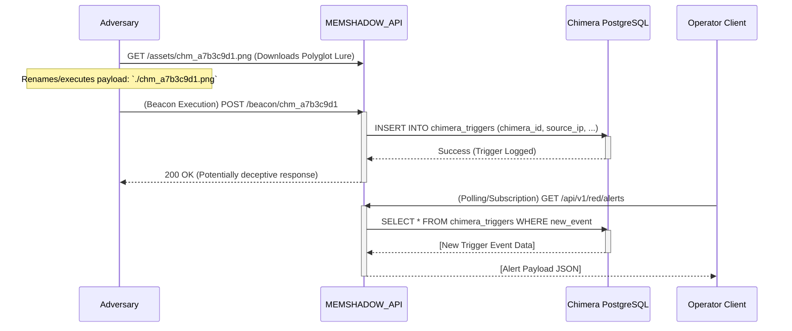

# CHIMERA Protocol

**Document ID:** MEMSHADOW-IMPL-001 (Adapted from ADJUNCT1.md)

The CHIMERA Protocol is a crucial security component of Project MEMSHADOW, designed to create an isolated and weaponized memory layer for deception, detection, and potential neutralization of adversarial access.

## 1. Strategic Mandate & Threat Model

### 1.1 Mandate
To engineer and deploy a multi-layered deception framework capable of:
-   Detecting and identifying adversarial access.
-   Optionally neutralizing threats.
-   Guaranteeing against the contamination of the primary `memshadow_main` memory pool.

### 1.2 Threat Model
CHIMERA specifically mitigates:
-   **T1. Accidental Contamination:** Operator error or buggy client retrieving deceptive data.
-   **T2. Malicious Querying:** Adversary with partial access attempting to discover the deception layer.
-   **T3. API Parameter Tampering:** Adversary manipulating API calls to query the wrong data store.
-   **T4. SQL/Vector Injection:** Adversary attempting to bridge primary and deceptive data stores at the database level.

## 2. Architectural Blueprint: The Segregation Doctrine

The protocol enforces absolute physical and logical separation at multiple layers.

### 2.1 Data Layer Segregation

**A. PostgreSQL Metadata Store:**
Two distinct tables with no shared foreign keys.

*   **Primary Table (`memories_primary`):**
    ```sql
    -- File: postgres_schema_main.sql
    CREATE TABLE memories_primary (
        id UUID PRIMARY KEY DEFAULT gen_random_uuid(),
        content_hash VARCHAR(64) UNIQUE NOT NULL,
        encrypted_content TEXT NOT NULL,
        metadata_json JSONB,
        created_at TIMESTAMPTZ DEFAULT NOW(),
        last_accessed_at TIMESTAMPTZ
    );
    ```
*   **CHIMERA Table (`memories_chimera`):**
    ```sql
    -- File: postgres_schema_chimera.sql
    CREATE TABLE memories_chimera (
        id UUID PRIMARY KEY DEFAULT gen_random_uuid(),
        lure_text_hash VARCHAR(64) UNIQUE NOT NULL,
        lure_text_encrypted TEXT NOT NULL,
        payload_type VARCHAR(50) NOT NULL, -- e.g., 'canary_token', 'polyglot_beacon', 'data_exfil_tracker'
        payload_encoding VARCHAR(20) NOT NULL, -- e.g., 'base64', 'hex'
        payload_data TEXT NOT NULL,         -- Encoded payload data
        trigger_condition VARCHAR(100),     -- Description of what triggers this lure
        alert_priority VARCHAR(20) DEFAULT 'CRITICAL',
        deployment_date TIMESTAMPTZ DEFAULT NOW()
    );

    -- Table for logging trigger events
    CREATE TABLE chimera_triggers (
        id BIGSERIAL PRIMARY KEY,
        chimera_id UUID REFERENCES memories_chimera(id),
        triggered_at TIMESTAMPTZ DEFAULT NOW(),
        source_ip INET,
        source_user_agent TEXT,
        details JSONB -- Specifics of the trigger, e.g., accessed URL, query parameters
    );
    ```

**B. ChromaDB Vector Store:**
Two distinct, named collections.
*   Primary Vectors: `memshadow_main`
*   CHIMERA Vectors: `memshadow_chimera`

**Important Security Note:** The application service account credentials for standard operations **must not** have `write` or `delete` permissions on the `memshadow_chimera` collection or the `memories_chimera` and `chimera_triggers` tables. These should be managed by a separate, higher-privilege process or role.

### 2.2 Application Layer Segregation (FastAPI)

Access is controlled via rigidly scoped API endpoints.

*   **Standard Retrieval Logic (Example):**
    Located in a module like `/app/routers/standard_ops.py`.
    ```python
    # /app/routers/standard_ops.py
    from app.auth import require_scope_and_log # Hypothetical auth decorator

    # @router.post("/retrieve") # Assuming 'router' is a FastAPI APIRouter instance
    # @require_scope_and_log(scope="memory:read")
    async def retrieve_memory(query: Query, db: AsyncSession = Depends(get_db)):
        PRIMARY_COLLECTION = "memshadow_main" # Non-negotiable constant
        # vector_matches = await vector_store.query(collection_name=PRIMARY_COLLECTION, ...)
        # Logic to query 'memories_primary' table using db session
        ...
    ```

*   **CHIMERA Endpoint Logic (Example):**
    Located in a separate, privileged module like `/app/routers/red_ops.py`.
    ```python
    # /app/routers/red_ops.py
    from app.auth import require_scope_and_log # Hypothetical auth decorator

    # @router.post("/chimera/deploy") # Assuming 'router' is a FastAPI APIRouter instance
    # @require_scope_and_log(scope="chimera:write") # Requires special privileges
    async def deploy_chimera_asset(asset: ChimeraAsset, db: AsyncSession = Depends(get_db)):
        CHIMERA_COLLECTION = "memshadow_chimera" # Non-negotiable constant
        # Logic to embed lure_text and store in CHIMERA_COLLECTION
        # Logic to insert metadata into 'memories_chimera' table
        ...
    ```

## 3. Trigger & Alerting Sequence

This sequence illustrates the designed trigger mechanism for a CHIMERA asset, such as a polyglot file acting as a beacon.



### Explanation:
1.  An adversary accesses a CHIMERA lure (e.g., a specially crafted file).
2.  Interaction with the lure (e.g., opening it, which executes embedded code) causes it to send a beacon signal back to a specific, monitored endpoint on the MEMSHADOW API.
3.  The MEMSHADOW API identifies this as a CHIMERA trigger.
4.  It logs the event in the `chimera_triggers` PostgreSQL table, capturing details like source IP, user agent, and the specific CHIMERA asset ID.
5.  The API might return a generic or deceptive response to the adversary.
6.  Separately, an authorized operator client (Commander_Client) polls or subscribes to an alert endpoint.
7.  The API queries the `chimera_triggers` table for new events and forwards them as alerts to the operator.

## 4. Operational Considerations

-   **Lure Creation:** CHIMERA assets (lures) must be carefully crafted to be enticing to potential adversaries while being clearly distinguishable from legitimate data by the MEMSHADOW system.
-   **Payloads:** Payloads can range from simple canary tokens (unique URLs that signal access) to more complex beacons or data exfiltration trackers.
-   **Alerting:** Robust and timely alerting to operators is critical when a CHIMERA asset is triggered. Alert fatigue should be managed by tuning asset sensitivity and deployment.
-   **Plausible Deniability:** The CHIMERA system should be designed such that its existence is not easily detectable by an adversary performing casual reconnaissance.

The CHIMERA protocol provides a vital layer of defense by actively monitoring for and reacting to unauthorized access attempts, helping to protect the integrity of the main MEMSHADOW memory pool.
