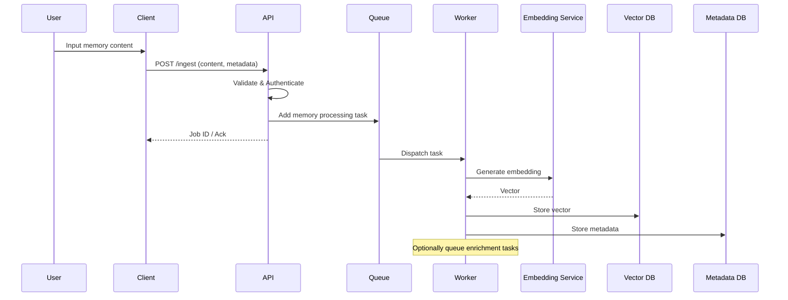
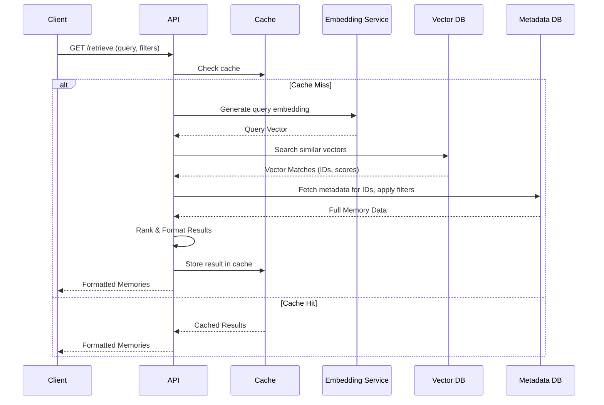

# MEMSHADOW Core Platform

The MEMSHADOW Core Platform is the central nervous system of the entire project. It encompasses the primary functionalities for memory ingestion, storage, retrieval, and enrichment. This document details its main architecture and functionalities as derived from the `README.md` and other relevant files.

## 1. Strategic Overview

The MEMSHADOW Core is designed to address the limitations of session-based memory in LLMs by providing a unified, persistent memory layer.

**Key Goals:**
-   Capture and persist all LLM interactions and related data.
-   Enable cross-platform memory retrieval.
-   Implement intelligent context injection for LLMs.
-   Maintain high security and privacy standards.
-   Scale to handle millions of memory entries.
-   Provide a foundation for advanced features like persona management and specialized protocols.

## 2. Core Architecture

The architecture is designed as a hybrid system, combining lightweight clients with a powerful VPS backend.

```mermaid
graph TB
    subgraph "Local Environment"
        CLI[memcli Client]
        BROWSER[Browser Extension]
        API_CLIENT[API Client Library]
    end

    subgraph "Network Layer"
        NGINX[NGINX Reverse Proxy]
        CLOUDFLARE[Cloudflare CDN]
    end

    subgraph "Application Layer (VPS Backend)"
        FASTAPI[FastAPI Backend API]
        AUTH[Auth Service (MFA/A)]
        QUEUE[Redis Queue (Celery)]
        WORKERS[Celery Workers]
    end

    subgraph "Data Layer"
        VECTOR[Chroma Vector DB]
        META[PostgreSQL Metadata DB]
        CACHE[Redis Cache]
        S3[S3 Object Storage (for artifacts)]
    end

    subgraph "Processing Layer"
        EMBED[Embedding Service]
        NLP[NLP Pipeline (Enrichment)]
        ML[ML Models (Future Use)]
    end

    CLI --> NGINX;
    BROWSER --> NGINX;
    API_CLIENT --> NGINX;
    NGINX --> CLOUDFLARE;
    CLOUDFLARE --> FASTAPI;

    FASTAPI --> AUTH;
    FASTAPI --> QUEUE;
    FASTAPI --> CACHE;
    FASTAPI --> VECTOR; % Direct query for some operations
    FASTAPI --> META;   % Direct query for some operations

    QUEUE --> WORKERS;
    WORKERS --> EMBED;
    WORKERS --> NLP;
    WORKERS --> ML;
    WORKERS --> VECTOR; % Primary write path for vectors
    WORKERS --> META;   % Primary write path for metadata
    WORKERS --> S3;
```

### Component Breakdown:

*   **Local Clients (`memcli`, Browser Extension, API Client Library):**
    *   Lightweight interfaces for capturing data, sending queries, and displaying results.
    *   Responsible for initial data formatting.
    *   `memcli` provides a command-line interface and a terminal GUI (npyscreen-based).
    *   Browser extensions enable capture from web interactions (e.g., Claude.ai).

*   **VPS Backend (FastAPI):**
    *   The main API endpoint built with FastAPI for high performance.
    *   Handles ingestion, retrieval, enrichment requests, and authentication.
    *   Manages asynchronous task queuing via Celery and Redis.

*   **Embedding Service:**
    *   Generates vector embeddings from text content.
    *   Supports multiple embedding providers (e.g., OpenAI, local Sentence Transformers).
    *   Includes caching for efficiency.

*   **Vector Store (ChromaDB):**
    *   Stores and indexes vector embeddings for semantic search.
    *   Optimized for similarity search at scale.

*   **Metadata Store (PostgreSQL):**
    *   Stores structured metadata associated with memories (e.g., timestamps, tags, user IDs, persona associations, source).
    *   Also stores user accounts, API keys, and other relational data.

*   **Cache (Redis):**
    *   Used for caching frequently accessed data, query results, and session information to improve performance.

*   **Queue (Redis with Celery Workers):**
    *   Manages background tasks such as memory processing, embedding generation, and enrichment.
    *   Allows the API to respond quickly while deferring heavy operations.

*   **Enrichment & Post-Processing Pipeline:**
    *   A set of asynchronous tasks (Celery-based) that run on memories after ingestion.
    *   Includes summarization, entity extraction, sentiment analysis, topic modeling, and clustering.
    *   Can leverage local LLMs for advanced enrichment tasks.

*   **Object Storage (S3-compatible):**
    *   Used for storing large binary artifacts or original documents linked to memories, keeping the primary databases lean.

## 3. Data Flow and Workflows

### 3.1 Ingestion Workflow

1.  **Capture:** Client (CLI, browser) captures content and associated metadata.
2.  **API Request:** Client sends data to the `/ingest` endpoint of the FastAPI backend.
3.  **Validation & Auth:** API validates input and authenticates the user.
4.  **Queuing:** A unique ID is generated, and the memory processing task is added to the Celery queue.
5.  **Async Processing (Worker):**
    *   **Embedding:** The Embedding Service generates a vector representation of the content.
    *   **Storage:** The vector is stored in ChromaDB, and metadata is stored in PostgreSQL.
    *   **Enrichment Trigger:** Further enrichment tasks (e.g., summarization) are queued.
6.  **Acknowledgement:** The API returns an immediate response (e.g., job ID) to the client.



### 3.2 Retrieval Workflow

1.  **Query Request:** Client sends a query (text, filters) to the `/retrieve` endpoint.
2.  **API Handling:** API validates, authenticates, and checks cache.
3.  **Query Embedding:** The query text is converted into a vector embedding.
4.  **Vector Search:** ChromaDB is queried using the query embedding to find semantically similar memories.
5.  **Metadata Filtering:** Results are further filtered/augmented using metadata from PostgreSQL (e.g., by date, tags).
6.  **Ranking:** Results are ranked based on relevance, recency, user preferences, etc.
7.  **Formatting:** Results are formatted for the client or for context injection.
8.  **Response:** Formatted memories are returned to the client.



## 4. Key Functionalities Implemented in Core

*   **Authentication & Authorization:** Secure user login, session management, API key handling (detailed in [MFA/A Framework](./mfaa.md)).
*   **Data Ingestion:** Endpoints and mechanisms for capturing diverse types of data.
*   **Semantic Search:** Core retrieval mechanism based on vector similarity.
*   **Metadata Filtering:** Ability to refine searches based on structured metadata.
*   **Asynchronous Processing:** Use of task queues for non-blocking operations.
*   **Caching:** Strategies to improve retrieval speed for common queries.
*   **Enrichment Framework:** A pipeline for various post-processing tasks on memories.
*   **Persona Management System (Advanced Feature):** Allows memories and interactions to be associated with different user-defined personas, adapting retrieval and context generation.
*   **Context Injection System:** Prepares and formats memory context for various LLMs, respecting their specific token limits and formatting requirements.
*   **Multi-Model Support:** Adapters and formatters to work with different LLM providers.
*   **Monitoring and Observability:** Logging, metrics, and health checks.
*   **Security:** Built-in security practices, encryption of data at rest and in transit.

## 5. Technology Stack (Core Components)

*   **Backend Framework:** FastAPI (Python)
*   **Vector Database:** ChromaDB
*   **Metadata Database:** PostgreSQL
*   **Cache & Message Queue:** Redis
*   **Task Processing:** Celery (Python)
*   **Embedding Models:** Sentence Transformers (local), OpenAI Ada-002 (remote)
*   **NLP Libraries:** spaCy, Transformers (Hugging Face)
*   **Deployment:** Docker, Docker Compose (potentially Kubernetes for production)

The MEMSHADOW Core Platform serves as the robust foundation upon which all specialized protocols and advanced features are built, ensuring a consistent, secure, and scalable memory solution.
