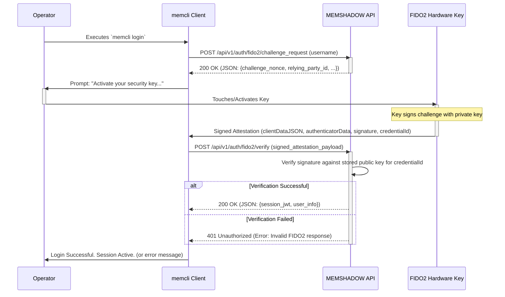

# MFA/A Framework (Multi-Factor Authentication & Authorization)

**Document ID:** MEMSHADOW-IMPL-003 (Adapted from ADJUNCT3.md)

The Multi-Factor Authentication and Authorization (MFA/A) Framework is designed to engineer and deploy a multi-layered, defense-in-depth authentication and session-validation system for MEMSHADOW. It aims to provide the highest possible assurance of operator identity at initial access and continuously validate that identity throughout the session.

## 1. Strategic Mandate & Threat Model

### 1.1 Mandate
-   Engineer a defense-in-depth authentication and session validation system.
-   Provide high assurance of operator identity at initial access.
-   Continuously validate identity throughout an operational session.
-   Be resilient against credential theft and session hijacking.

### 1.2 Threat Model
This framework is designed to neutralize:
-   **T1. Credential Theft:** Adversary obtaining static passwords or API keys.
-   **T2. Replay Attacks:** Adversary capturing and replaying authentication requests.
-   **T3. Session Hijacking:** Adversary gaining control of a logged-in operator's session or token.
-   **T4. Insider Threat:** Malicious insider attempting to operate outside normal behavioral parameters.

## 2. Core Components: A Layered Defense

The framework combines two distinct security technologies:

*   **Component A: FIDO2/WebAuthn (Primary Authenticator)**
    *   **Function:** High-assurance, phishing-resistant initial login and explicit re-validation.
    *   **Mechanism:** Uses public-key cryptography where a hardware-backed private key (e.g., YubiKey, TPM) signs a unique server challenge, proving key possession without exposing the key.
    *   **Role:** The "gatekeeper" for irrefutable proof of identity at specific moments.

*   **Component B: Behavioral Biometrics (Continuous Authenticator)**
    *   **Function:** Passive, continuous validation of the operator's identity during a session.
    *   **Mechanism:** Analyzes telemetry of operator interactions (command velocity, query complexity, typing patterns) to build a unique behavioral signature.
    *   **Role:** The "sentinel" that continuously verifies if the current user is the one who logged in.

## 3. Architectural Implementation

### 3.1 Initial Authentication Flow (`memcli login` using FIDO2)

This sequence details the phishing-resistant login process using a FIDO2 hardware key.



### 3.2 Continuous Verification & Step-Up Authentication

This protocol protects the active session after the initial FIDO2 login.

#### 3.2.1 Telemetry Collection
With every authenticated API call, the `memcli` client transparently appends a small, encrypted metadata block containing behavioral telemetry.

*   **Metrics Examples:**
    *   `inter_command_latency_ms`: Time since the last command.
    *   `query_complexity_score`: Score based on keywords, filters, operators in a retrieval query.
    *   `payload_size_bytes`: Size of data ingested.
    *   `typing_cadence_wpm` (optional, for TUI): Typing speed during interactive input.
    *   `error_rate_cli`: Frequency of command errors or typos.

#### 3.2.2 Baseline Modeling (Backend)
The MEMSHADOW API maintains a dynamic behavioral model for each active user session.

*   **Mechanism:** A simple moving average (SMA) and standard deviation are calculated for each telemetry metric over a rolling window (e.g., last 50 commands).
*   **Storage:** This model is stored in a Redis cache for the duration of the session and discarded upon logout or session expiry.

#### 3.2.3 The "Step-Up" Trigger Mechanism

1.  **Deviation Detection:** The API compares incoming telemetry for each request against the established baseline model for that session. If a metric deviates significantly (e.g., `inter_command_latency_ms` is consistently 3 standard deviations below average, suggesting automation), a session "suspicion score" is incremented.
2.  **Threshold Breach:** If the suspicion score exceeds a predefined threshold, the **Step-Up Protocol** is initiated.
3.  **Token Invalidation:** The API server immediately and irrevocably invalidates the user's current JWT. The token ID is added to a blacklist in the Redis cache (e.g., using a short TTL).
4.  **Client Challenge:** The next time `memcli` attempts to use the invalidated token, the API rejects it with a `401 Unauthorized` status and a custom header: `X-MEMSHADOW-Auth-Action: FIDO2_REAUTH_REQUIRED`.
5.  **Seamless Re-Authentication:** The `memcli` client is programmed to recognize this specific header. Instead of displaying a generic error, it automatically initiates the FIDO2 login flow described in section 3.1 (potentially with a message like "Session re-verification required. Please tap your security key.").
6.  **Session Restoration:** Upon successful FIDO2 re-verification, a new JWT is issued. The `memcli` client automatically re-tries the command that was initially rejected. The behavioral model for the session is flushed and begins rebuilding.
    *   To a legitimate operator, this appears as a momentary request to tap their security key.
    *   To a hijacker who lacks the FIDO2 hardware key, the session is irrevocably terminated.

## 4. Implementation Details & Data Schemas

### 4.1 Recommended Libraries

*   **Backend (Python):** `webauthn-lib` for server-side FIDO2/WebAuthn logic.
*   **Client (`memcli` in Python):** May need to interface with platform-specific FIDO2 APIs or use a library like `fido2` (python-fido2) that abstracts this.

### 4.2 Database Schema Additions (PostgreSQL)

A table is required to associate FIDO2 devices (authenticators) with user accounts.

```sql
-- File: postgres_schema_auth_mfa.sql

-- Assuming a 'users' table exists with a primary key 'id' (e.g., UUID)
-- CREATE TABLE users (
--     id UUID PRIMARY KEY DEFAULT gen_random_uuid(),
--     username VARCHAR(255) UNIQUE NOT NULL,
--     email VARCHAR(255) UNIQUE NOT NULL,
--     -- ... other user fields
-- );

CREATE TABLE user_security_devices (
    id UUID PRIMARY KEY DEFAULT gen_random_uuid(),
    user_id UUID NOT NULL REFERENCES users(id) ON DELETE CASCADE,
    device_name VARCHAR(100) NOT NULL, -- User-friendly name for the device
    credential_id BYTEA UNIQUE NOT NULL,   -- The unique ID for the key, provided by the authenticator (WebAuthn's `rawId`)
    public_key_cbor BYTEA NOT NULL,        -- The COSE-encoded public key
    signature_count BIGINT DEFAULT 0,     -- The signature counter to prevent cloning (WebAuthn's `signCount`)
    aaguid UUID,                          -- Authenticator Attestation Globally Unique Identifier (optional, for metadata)
    transports VARCHAR(50)[],             -- Transports supported by authenticator e.g., {'usb', 'nfc', 'ble'} (optional)
    registered_at TIMESTAMPTZ DEFAULT NOW(),
    last_used_at TIMESTAMPTZ
);

CREATE INDEX idx_user_security_devices_user_id ON user_security_devices(user_id);
```

**Notes on Schema:**
-   `credential_id`: This is the `id` (often base64url encoded `rawId`) of the credential generated by the authenticator. It must be unique.
-   `public_key_cbor`: Stores the public key in COSE (CBOR Object Signing and Encryption) format.
-   `signature_count`: Essential for preventing cloned authenticators. The server must verify that this counter increments with each signature.

## 5. Security Considerations

-   **Secure Storage of Public Keys:** While public keys are public, their association with users must be protected.
-   **Challenge Nonce:** Server-generated challenges must be random, unique, and short-lived to prevent replay attacks.
-   **Relying Party ID:** The Relying Party ID (usually the domain name) must be correctly configured and validated.
-   **Behavioral Model Security:** The parameters of the behavioral biometric model and the suspicion score thresholds should be configurable and not easily guessable.
-   **Telemetry Encryption:** Telemetry data sent from the client should be encrypted to prevent eavesdropping on behavioral patterns.

The MFA/A Framework provides a robust, dynamic security posture, moving beyond static authentication to create an environment actively hostile to unauthorized access and session hijacking.
