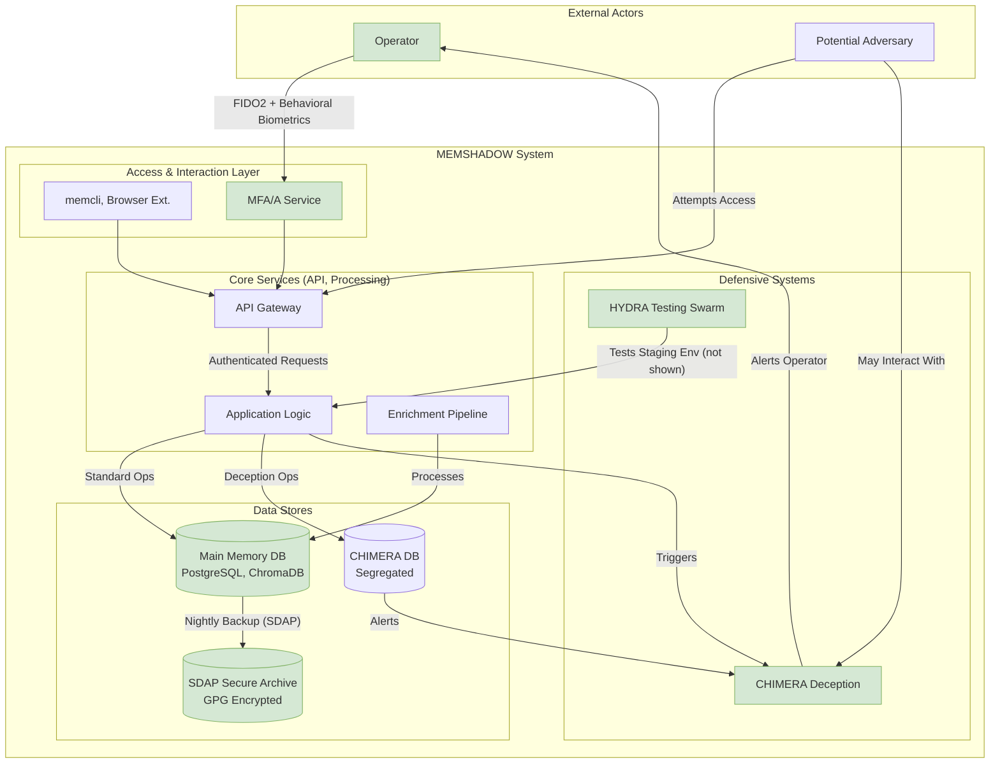

# Project MEMSHADOW Security Overview

Security is a foundational pillar of Project MEMSHADOW. This document provides a consolidated overview of the security posture, incorporating information from various components like CHIMERA, SDAP, MFA/A, JANUS, and the overall system architecture.

## 1. Core Security Principles

-   **Defense in Depth:** Implementing multiple layers of security controls.
-   **Least Privilege:** Granting only necessary permissions to users and services.
-   **Data Confidentiality, Integrity, and Availability (CIA Triad):** Protecting data from unauthorized access, ensuring its accuracy, and making it available when needed.
-   **Security by Design:** Integrating security into every phase of the development lifecycle.
-   **Zero Trust (Aspirational):** Continuously verifying trust, rather than assuming it based on network location.

## 2. Authentication and Authorization

The **[MFA/A Framework](./components/mfaa.md)** is central to user and session security.

*   **Multi-Factor Authentication (MFA):**
    *   **Primary Authenticator:** FIDO2/WebAuthn for phishing-resistant initial login and explicit re-validation. Utilizes hardware-backed private keys.
    *   **Supported Authenticators:** YubiKeys, platform authenticators (TPMs), etc.
*   **Continuous Authentication (Behavioral Biometrics):**
    *   Passively analyzes operator interaction telemetry (command velocity, query complexity, typing patterns) to build a unique behavioral signature for each session.
    *   Detects deviations from the baseline, indicating potential session hijacking.
*   **Step-Up Authentication:**
    *   If a session's "suspicion score" (based on behavioral deviations) exceeds a threshold, the current JWT is invalidated.
    *   The user is challenged for FIDO2 re-authentication to restore the session.
*   **Authorization:**
    *   Role-Based Access Control (RBAC) is implied for different operations (e.g., `memory:read`, `chimera:write`).
    *   API endpoints are scoped to specific permissions.

## 3. Data Security

*   **Encryption at Rest:**
    *   **Primary Memory Pool (`memshadow_main`):** Content is encrypted. Specific algorithms (e.g., AES-256) and key management strategies (user-specific DEKs encrypted with a master key) are detailed in the main security architecture (`README.md` section 8).
    *   **CHIMERA Lures (`memories_chimera`):** `lure_text_encrypted` indicates encryption.
    *   **SDAP Archives:** Archives are encrypted using GPG with AES256 before transmission and storage (see [SDAP documentation](./components/sdap.md)).
*   **Encryption in Transit:**
    *   All API communication should be over HTTPS/TLS.
    *   Secure protocols like SCP (via SSH) are used for SDAP data transfer.
    *   mTLS (mutual TLS) is proposed for communication with a "Key Oracle" if JANUS Option 3 (Network Seal) were implemented.
*   **Data Segregation:**
    *   **CHIMERA Protocol:** Mandates absolute physical and logical separation of primary data stores and CHIMERA deception stores (PostgreSQL tables, ChromaDB collections). Service accounts for standard operations lack write/delete permissions on CHIMERA stores.
*   **Data Integrity:**
    *   SDAP includes hash verification (SHA256) of archives after transmission to ensure integrity.
    *   Content hashes (`content_hash`, `lure_text_hash`) are used in database schemas to ensure uniqueness and can aid in integrity checks.

## 4. Application Security

*   **API Security:**
    *   Input validation for all API endpoints (handled by FastAPI with Pydantic).
    *   Protection against common web vulnerabilities (OWASP Top 10).
    *   Rate limiting to prevent abuse.
    *   Scoped API keys with expiry and optional IP restrictions.
*   **Static Application Security Testing (SAST):**
    *   HYDRA Phase 1 uses `Bandit` to scan the Python codebase for common security flaws.
*   **Dependency Security Auditing:**
    *   HYDRA Phase 1 uses `pip-audit` to check for known vulnerabilities in third-party Python dependencies.
*   **Container Image Scanning:**
    *   HYDRA Phase 1 uses `Trivy` to scan Docker images for CVEs.

## 5. Infrastructure & Operational Security

*   **Secure Archival (SDAP & JANUS):**
    *   Automated, encrypted backups to an operator-controlled server.
    *   **[JANUS Protocol](./components/janus.md):** Focuses on portable sealing mechanisms for SDAP's GPG passphrase, avoiding hard-binding to specific hardware.
        *   Recommended: Environment-Derived Sealing, where the GPG passphrase can be derived from operator-controlled environmental factors (e.g., a secret file).
    *   Restricted SSH access for the `sdap_receiver` user on the archival server.
*   **Automated Adversarial Simulation (HYDRA):**
    *   **[HYDRA Protocol](./components/hydra.md):** Provides continuous security validation.
        *   **Phase 1 (Crawl):** CI/CD integrated static analysis and scanning.
        *   **Phase 2 (Walk):** Scripted adversarial simulation against a live staging environment.
        *   **Phase 3 (Run) - [SWARM](./components/swarm.md):** Autonomous agent swarm for discovering novel attack paths in an isolated "Arena."
*   **Deception Technology (CHIMERA):**
    *   **[CHIMERA Protocol](./components/chimera.md):** Detects, identifies, and can potentially neutralize adversarial access using lures and honeypots.
    *   Provides early warning of breaches or unauthorized reconnaissance.
*   **System Hardening:**
    *   Secure configuration of operating systems and services.
    *   Principle of least privilege for service accounts.
*   **Monitoring & Alerting:**
    *   Real-time alerts for CHIMERA triggers.
    *   Review of HYDRA reports for potential vulnerabilities.
    *   Comprehensive logging and auditing of security-relevant events.

## 6. Threat Modeling & Mitigation

The system is designed to mitigate various threats:

*   **Accidental Contamination/Data Leakage:** Segregation by CHIMERA, strong access controls.
*   **Malicious Querying/API Tampering:** Rigid API scoping, CHIMERA deception.
*   **SQL/Vector Injection:** Use of ORMs, parameterized queries, input validation. CHIMERA data segregation limits blast radius.
*   **Credential Theft:** MFA/A framework (FIDO2), secure storage of API keys (hashed).
*   **Replay Attacks:** Nonce-based challenges in FIDO2, secure session management.
*   **Session Hijacking:** Behavioral biometrics and Step-Up Authentication in MFA/A.
*   **Insider Threats:** Behavioral biometrics, audit logs, principle of least privilege.
*   **Data Exfiltration:** Encryption at rest and in transit, CHIMERA lures designed to track exfiltration attempts.

## 7. Security Architecture Diagram (High-Level)

## 8. Future Security Enhancements (from Roadmap)

-   Quantum-Resistant Encryption research.
-   Zero-Knowledge Memory Proofs.
-   Decentralized memory verification (Blockchain integration).

This security overview highlights the multi-faceted approach Project MEMSHADOW takes to protect its data and operations. Each component plays a role in the overall defensive strategy. Continuous vigilance, testing (via HYDRA), and adaptation are key to maintaining a strong security posture.
